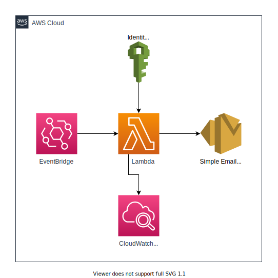

# AWS Access Keys

Periodically check to see if an access key is required a rotation. This application uses the AWS CDK to create 2 stacks:
  - CheckKeysLambdaStack
  - EventBridgeStack

Emails:
- Warning emails sent every day, 7 days (default) before being deleted.
- Deletion email sent after the 7 days (default) stating the keys have been deleted.



## Configuration

To configure the stack, edit the following variables:

- `ADMIN_EMAIL_ADDRESSES`
  - Necessity: Required
  - Type: `Array<string>`
  - Location: `REPO_ROOT/lib/lambdas/check-keys.ts`
  - Description: Admin email addresses if username doesn't confirm to regex email expression.
- `SOURCE_EMAIL_ADDRESS`
  - Necessity: Required
  - Type: `string`
  - Location: `REPO_ROOT/lib/lambdas/check-keys.ts`
  - Description: The sender email address to use in SES.
- `EventBridge.Schedule.cron()`
  - Necessity: Optional
  - Default: `0, 0, *, *, *` (midnight, every day)
  - Type: `EventBridge.CronOptions`
  - Location: `REPO_ROOT/lib/event-bridge.ts`
  - Description: Cron expression for EventBridge to use.
- `WARNING_AGE`
  - Necessity: Optional
  - Default: `7171200000` (83 days in ms)
  - Type: `number`
  - Location: `REPO_ROOT/lib/lambdas/check-keys.ts`
  - Description: Minimum age of keys when warning emails are sent.
- `DELETE_AGE`
  - Necessity: Optional
  - Default: `7776000000` (90 days in ms)
  - Type: `number`
  - Location: `REPO_ROOT/lib/lambdas/check-keys.ts`
  - Description: Maximum age of keys. Keys this age will be deleted.

## Deployment

To deploy these stacks, execute:

```sh
$ cdk deploy --all
```

## Destroy

To destroy the stacks, execute:

```sh
$ cdk destroy --all
```